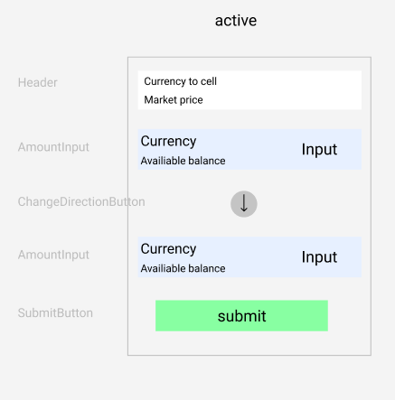
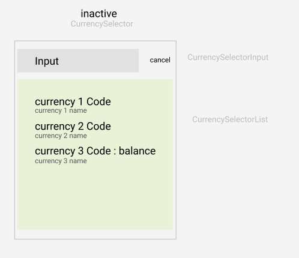

## REVOLUT exchange app

use `yarn` to install all dependencies  
use `yarn run start` to run app on localhost:3000 (browser will open automatically)  
use `yarn run test` to run tests
___
### Store

Store have two substores - one for manage app, second for manage data

###### App store actions:
1. Save selected currency
2. Save amount
3. Submit exchange
4. Show currency selector
5. Hide currency selector
6. Show notification
7. Hide notification
8. Change exchange direction
9. Set is amount invalid
10. Set is amount valid
11. Fetch rates
12. Save rates
13. Fetch available balance
14. Save available balance

###### Data store actions:
1. Fetch rates
2. Save rates
3. Fetch available balance
4. Save available balance

###### Store structure:

app | data
----|------
currencySelector|availableBalance
amount|rates
isAmountInvalid|
selectedCurrency|
notification|
exchangeType|

___
### Requests

For feed of rates I use api.ratesapi.io
other requests is mocked

1. **GET** - fetch account data (on app start, or after submit)  
2. **GET** - fetch fx rates (on app start, with interval 10min)  
3. **POST** - exchange submit

I think that the best option for price feed will be websocket or event sourcing, which will respond to all available rates.
___

### Components wireframes

main app  

currencySelector  
